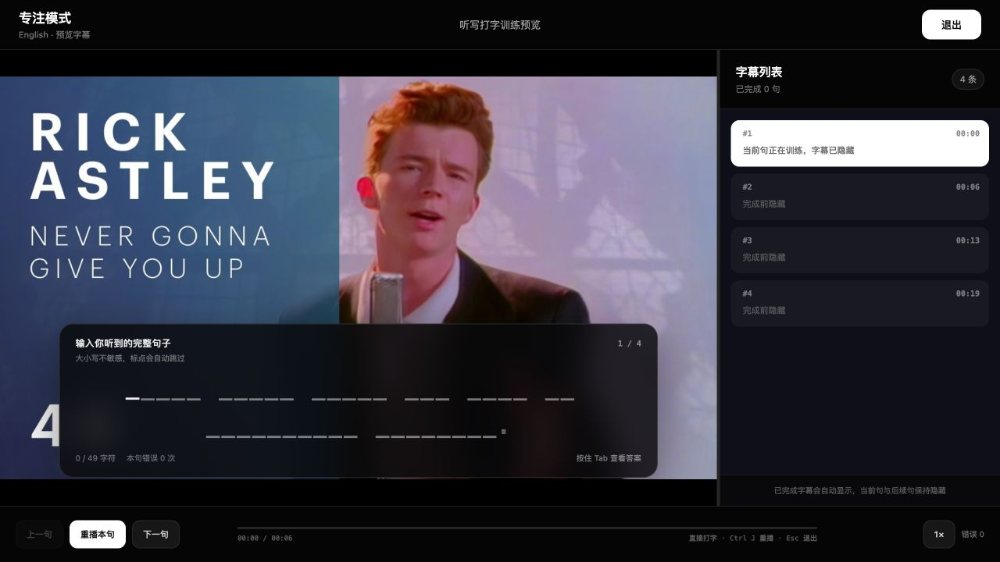

# English Listening Typing

一个基于 YouTube 原声与英文字幕的 Chrome 听写训练扩展。点击扩展按钮后，它会把当前视频切换为专注训练界面：逐句播放、隐藏答案、接收键盘输入，并在答对后复播原句。

项目使用 Chrome Extension Manifest V3，无需安装依赖、执行构建或部署后端。中文翻译为可选功能，需要使用你自己的 DeepSeek API Key。



## 功能特性

- 自动读取当前 YouTube 视频的英文字幕，并从当前播放位置开始训练。
- 优先使用人工英文字幕；存在自动字幕时，尽可能利用逐词时间戳改善句子播放边界。
- 自动处理滚动字幕的重复词，并根据标点、语法、大小写和停顿重新划分句子。
- 自动移除 `[Music]`、`(Laughter)`、`(Applause)` 等非对白提示。
- 直接通过键盘填写字符槽，无需点击输入框；大小写不敏感，标点自动跳过，空格需要输入。
- 输入错误时只清空当前单词，已经完成的单词会保留。
- 答对后显示整句、自动复播，并支持停留跟读或自动进入下一句。
- 支持查看答案、单词悬停查词、英美音标与发音。
- 可选 DeepSeek 简体中文翻译，按批预取并在本机缓存 7 天。
- 支持上一句、下一句、重复播放、播放速度、音效、字幕面板拖动和错误次数统计。

## 安装

本项目目前通过 Chrome 开发者模式安装：

1. 下载或克隆本项目。
2. 在 Chrome 地址栏打开 `chrome://extensions/`。
3. 打开页面右上角的“开发者模式”。
4. 点击“加载已解压的扩展程序”。
5. 选择本项目所在目录。
6. 打开一个带英文字幕的 YouTube 视频，点击浏览器工具栏中的扩展图标。

如果扩展图标没有显示，可以在 Chrome 的扩展菜单中将它固定到工具栏。修改代码后，需要回到 `chrome://extensions/` 点击“重新加载”。

## 使用方法

1. 打开带英文字幕的 YouTube 视频，将进度移动到想开始训练的位置。
2. 点击扩展图标。扩展会读取字幕并播放当前句。
3. 原句播放结束后，直接输入听到的内容。
4. 答对后，扩展会显示答案和可选中文翻译，并自动复播本句。
5. 默认会停留在当前句，方便反复跟读；按 `Enter` 或 `→` 继续。
6. 点击右上角“退出”或按 `Esc` 返回原 YouTube 页面。

当前句及后续字幕默认隐藏，已经完成的句子才会显示在右侧字幕列表中。

### 快捷键

| 按键 | 作用 |
| --- | --- |
| 直接输入 | 填写当前听写内容 |
| `Backspace` | 删除上一个已接受字符 |
| `Tab` | 显示或隐藏答案；显示后可悬停查词 |
| `Ctrl + J` / `Command + J` | 重播本句 |
| `Enter` / `→` | 答对并停留时进入下一句 |
| `Space` | 非输入阶段播放或暂停；答对并停留时重播 |
| `Esc` | 退出训练 |

## 中文翻译设置

在训练页底部点击“设置”，可以配置：

- 是否显示简体中文翻译；
- DeepSeek API Key；
- 答对后停留当前句，或自动进入下一句。

翻译固定使用 `deepseek-v4-flash`。扩展每次最多预取 10 句，并将结果缓存 7 天。设置页提供“测试连接”按钮，可在保存前验证 API Key。

不配置 API Key 不影响字幕听写、查词及其他本地训练功能。

## 字幕处理方式

扩展会依次尝试从当前播放器和 YouTube 播放器接口获取字幕轨，并优先选择英文人工字幕。字幕进入训练前会经过以下处理：

1. 清理 HTML、声音提示和无效空白；
2. 消除滚动字幕中重复出现的词；
3. 将同一条字幕中的多个完整句子拆开；
4. 根据句末标点、文本连续性、大小写和停顿合并碎片；
5. 再将过长句子切成适合初学者的练习单元，不必等到句号：优先选择逗号、分号、破折号和从句边界，通常不超过 14 个单词、96 个字符或 8.5 秒；
6. 在可用时将人工字幕与自动字幕的逐词时间对齐；
7. 为每个练习单元生成独立的播放起止时间。

这样既能减少机械地按固定时长切句所产生的半句、孤立单词和跨段拼接，也能避免初学者一次听写过长的完整句子。

## 本地开发与测试

项目没有 npm 依赖和构建步骤，修改 HTML、CSS 或 JavaScript 后重新加载扩展即可。

运行字幕分句回归测试：

```bash
node caption-segmentation.test.js
```

只预览界面：

```bash
python3 -m http.server 4173
```

然后访问 [http://127.0.0.1:4173/preview.html](http://127.0.0.1:4173/preview.html)。预览页使用演示字幕，不会读取 YouTube，也不代表扩展已安装。

## 项目结构

| 文件 | 说明 |
| --- | --- |
| `manifest.json` | Chrome 扩展清单、权限和入口配置 |
| `background/` | Service worker：消息入口、设置、翻译、查词和 YouTube 页面通信 |
| `content/` | 内容脚本：训练控制、字幕处理与获取、渲染、词典和界面模板 |
| `styles/` | 按基础布局、练习区、词典、控制区和响应式规则拆分的界面样式 |
| `options.html` / `options.js` / `options.css` | 扩展设置页 |
| `preview.html` | 无需安装扩展的本地界面预览 |
| `caption-segmentation.test.js` | 字幕去重、拆分与合并的回归测试 |
| `design-qa.md` | 界面与交互验收记录 |

## 权限、网络与隐私

扩展申请以下权限：

- `activeTab`、`scripting`：在用户主动点击扩展后读取当前 YouTube 页面和播放器字幕信息；
- `storage`：在当前 Chrome 配置中保存设置、API Key 和翻译缓存；
- YouTube 域名权限：读取视频和字幕；
- DeepSeek 域名权限：仅在启用翻译并配置 API Key 后发送字幕翻译请求；
- 夸克和有道域名权限：分别用于单词释义和用户主动点击的发音播放。

项目没有登录、注册、分析埋点、自建后端或会员系统。训练输入与错误统计不会上传。启用翻译后，待翻译字幕会发送到 DeepSeek；悬停查词时，当前单词会发送到夸克；点击发音时会请求有道音频。

API Key 保存在 `chrome.storage.local` 中，不会同步到其他设备，也不会暴露给 YouTube 页面。但它仍属于当前浏览器配置中的本地敏感数据，请不要在共享浏览器配置或不可信设备中保存长期密钥。

## 常见问题

### 点击扩展后没有反应

确认当前页面是 `youtube.com` 的视频页面。如果扩展是在该页面打开后才安装的，请刷新页面，或在 `chrome://extensions/` 重新加载扩展后再试。

### 提示找不到字幕

确认视频确实提供英文字幕，并先在 YouTube 播放器中尝试开启字幕。部分受地区、登录状态或内容限制影响的视频可能无法返回字幕数据。

### 视频没有自动播放

Chrome 可能阻止页面自动播放。点击训练页中的“重播本句”即可继续。

### 答对后没有中文翻译

打开“设置”，确认中文翻译已启用、API Key 已填写，并使用“测试连接”检查网络和密钥状态。翻译失败不会阻止听写继续进行。

## 当前限制

- 仅支持 Chrome Manifest V3 兼容浏览器中的 YouTube 网页版。
- 训练依赖视频自身提供的英文字幕，字幕质量会影响分句和时间对齐效果。
- YouTube 页面结构或字幕接口变化后，字幕读取逻辑可能需要相应更新。
- DeepSeek 翻译和在线词典依赖第三方服务的可用性与接口兼容性。
